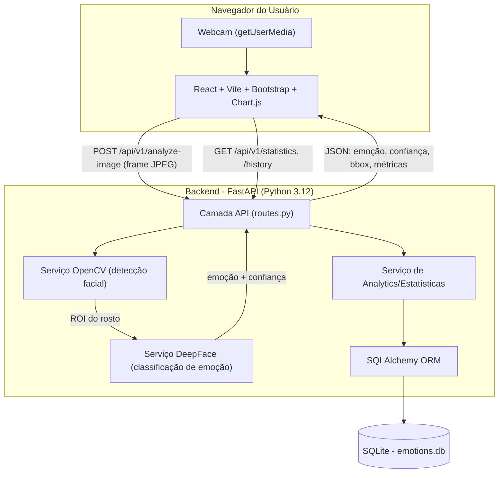
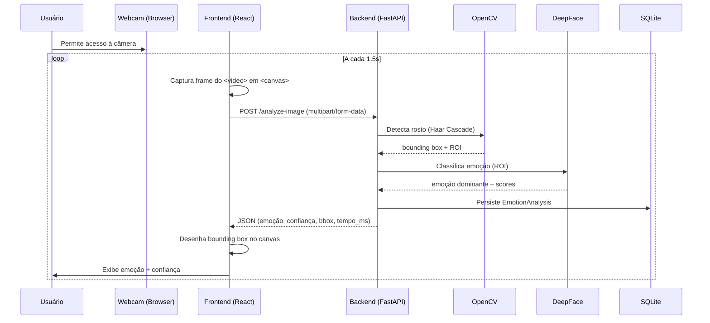
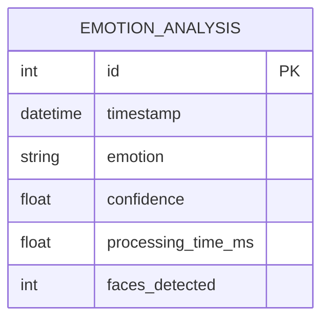

# Diagrama de Arquitetura — Sistema de Reconhecimento de Emoções

## Visão Geral dos Componentes

## Fluxo de Análise (sequência)

## Modelo de Dados

## Camadas (Clean Architecture simplificada)

- **API Layer** (`app/api`): contratos HTTP, validação de entrada/saída (Pydantic).
- **Service Layer** (`app/services`): regras de negócio — `emotion_service` (CV/IA) e `analytics_service` (estatísticas).
- **Model/Domain Layer** (`app/models`): entidades ORM e schemas Pydantic.
- **Database Layer** (`app/database`): configuração de engine/sessão SQLAlchemy.

Essa separação permite testar a lógica de IA isoladamente da camada HTTP e trocar o banco de dados (SQLite → PostgreSQL, por exemplo) sem impactar as camadas superiores.
